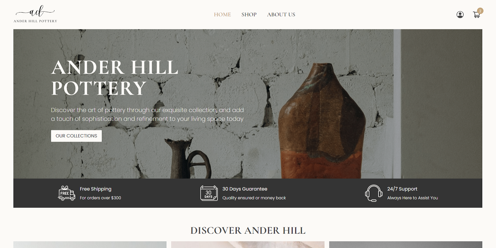
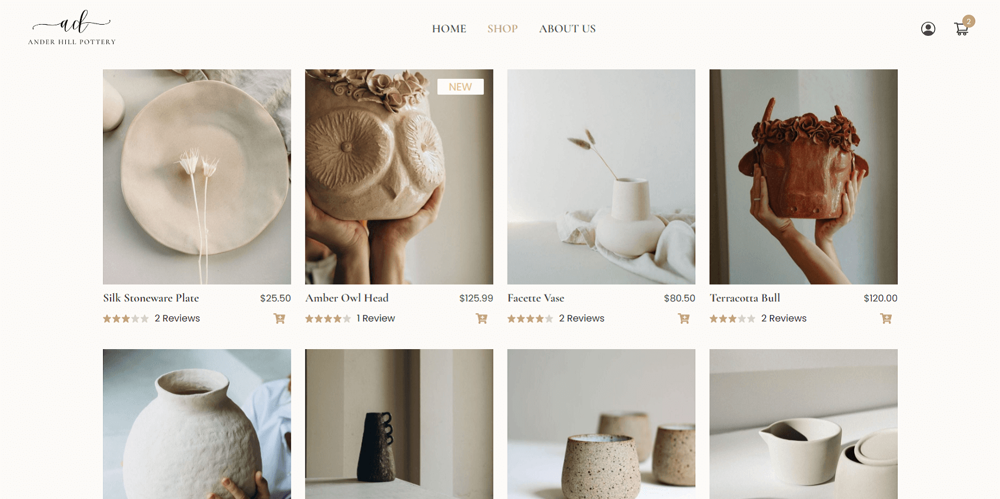
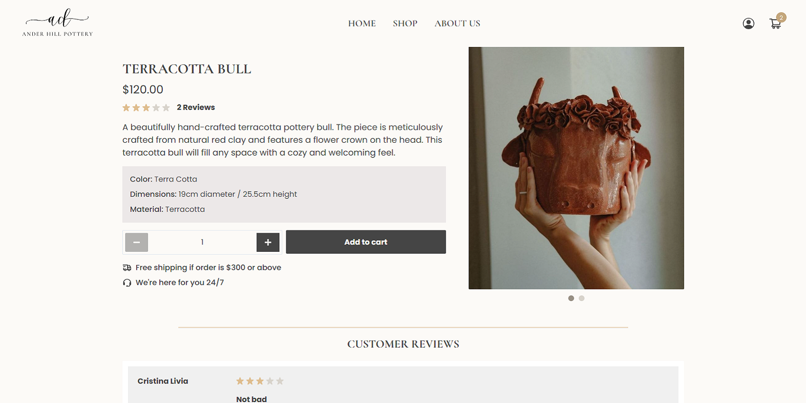

# AnderHill e-Commerce 

**Home Page**

**Products Page**

**Product Page**

**Technologies Used**
-	React
-	Chakra UI
-	Redux Toolkit
-	Express.js
-	Node.js 

**About** 

This is a pottery eCommerce application built using the MERN (MongoDB, Express.js, React, and Node.js) stack along with Chakra UI for the user interface. The application allows users to browse and purchase pottery products, manage their cart, checkout, and perform user authentication.

**Key Features:**
- Displays a list of pottery products with category filtering options, allowing users to browse and search for specific products.
- A seamless checkout process allows users to review their cart, enter shipping details, and securely complete the purchase using PayPal payment integration.
- Uses MongoDB for database storage, allowing for efficient and scalable data management. 
- Uses Formik and Yup for easy and robust form validation, ensuring that user input is accurate and meets the required criteria.
- Implements JSON Web Tokens (JWT) for secure user authentication and authorization. Supports user registration and login, allowing users to create an account, log in, and log out. User information, such as shipping addresses and order details, is securely stored and managed. 
